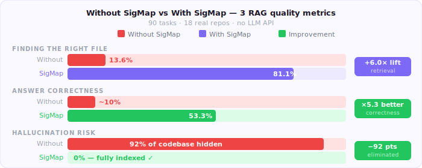

<div align="center">


# ⚡ SigMap

**SigMap finds the right files before your AI answers.**

[](https://www.npmjs.com/package/sigmap)
[](https://www.npmjs.com/package/sigmap)
[](https://github.com/manojmallick/sigmap/actions/workflows/ci.yml)
[](package.json)
[](LICENSE)
[](https://github.com/manojmallick/sigmap/stargazers)
[](https://starmapper.bruniaux.com/manojmallick/sigmap)
[](https://star-history.com/#manojmallick/sigmap&Date)
[](https://shypd.ai/tools/sigmap)

</div>

---

## Try it now

**No install required.** Run instantly on any machine:

```bash
npx sigmap
npx sigmap ask "Where is auth handled?"
```

Zero config. Zero dependencies. Under 10 seconds.

---

## What is SigMap?

SigMap extracts function and class signatures from your codebase and feeds the right files — not the whole repo — to your AI.

**Model-agnostic.** Works with:
- **Cloud LLMs:** Claude, GPT-4, Copilot, Gemini
- **Open-source agents:** OpenCode, Aider, OpenHands, Cline
- **Local LLMs:** Ollama, llama.cpp, vLLM (no API keys, full privacy)
- **Any editor:** VS Code, Cursor, Windsurf, Neovim, JetBrains
- **Any model:** Use what you want, no vendor lock-in

---

## Why SigMap?

- **75.6% hit@5** — right file found in top 5 results (vs 13.6% baseline)
- **97.0% token reduction** — average across 21 real repos
- **52.2% task success rate** — up from 10% without context
- **1.72 prompts per task** — down from 2.84 (39.4% fewer retries)
- **31 languages supported** — TypeScript, Python, Go, Rust, Java, R, and 25 others
- **No vendor lock-in** — works with any AI assistant or local LLM
- **No API costs** — use local models (Ollama, llama.cpp, vLLM) with zero token fees
- **Full privacy** — keep your code and context on your machine
- **Zero npm dependencies** — `npx sigmap` on any machine

---

## Replace this with SigMap

| Without SigMap | With SigMap |
|---|---|
| ❌ Guessing which files are relevant | ✅ Right file in context — 76% of the time |
| ❌ Sending the full repo to your AI | ✅ Minimal context — only what matters |
| ❌ Embeddings / vector DB required | ✅ Grounded answers, no infra needed |

---

## How it works

```
Ask → Rank → Context → Validate → Judge → Learn
```

1. **Ask** — `sigmap ask "Where is auth handled?"` — ranked file list
2. **Rank** — TF-IDF scores every file against your query
3. **Context** — writes compact signatures to your AI's context file
4. **Validate** — `sigmap validate` — confirms right files are in scope
5. **Judge** — `sigmap judge` — scores answer groundedness against context
6. **Learn** — `sigmap weights` — boosts files that keep solving your tasks

---

## Benchmark

```
Benchmark : sigmap-v7.0-main (21 repositories, including R language)
Date      : 2026-06-19

Hit@5          : 75.6%   (baseline 13.6%  — 5.6× lift)
Token reduction: 97.0%   (across 21 repos)
Prompt reduction : 39.4% (2.84 → 1.72 prompts per task)
Task success   : 52.2%   (baseline 10%)
Repos tested   : 21 (JavaScript, Python, Go, Rust, Java, R, C++, C#, Dart, Swift, Ruby, PHP, Scala, Kotlin, and more)
```

Measured on 90 coding tasks across 18 real public repos. No LLM API — fully reproducible.

**Resources:**
- [Full methodology →](https://sigmap.io/guide/benchmark.html)
- [Benchmark suite (GitHub)](https://github.com/manojmallick/sigmap-benchmark-suite) — scripts, tasks, and raw data
- [Benchmark data (Zenodo)](https://zenodo.org/records/19898842) — archived results for reproducibility

<div align="center">

</div>

---

## Install

**Try without installing:**

```bash
npx sigmap
```

**Install globally:**

```bash
npm install -g sigmap
```

**Install per-project:**

```bash
npm install --save-dev sigmap
```

**Standalone binary** — no Node.js required:

| Platform | Download |
|---|---|
| macOS Apple Silicon | [`sigmap-darwin-arm64`](https://github.com/manojmallick/sigmap/releases/latest/download/sigmap-darwin-arm64) |
| macOS Intel | [`sigmap-darwin-x64`](https://github.com/manojmallick/sigmap/releases/latest/download/sigmap-darwin-x64) |
| Linux x64 | [`sigmap-linux-x64`](https://github.com/manojmallick/sigmap/releases/latest/download/sigmap-linux-x64) |
| Windows x64 | [`sigmap-win32-x64.exe`](https://github.com/manojmallick/sigmap/releases/latest/download/sigmap-win32-x64.exe) |

Each binary ships with a `.sha256` checksum. [Verify a binary →](docs/readmes/binaries.md)

**Volta:**

```bash
volta install sigmap
```

---

## Integrations

**AI assistants — one run, all of them:**

| Adapter | Output file | Used by |
|---|---|---|
| `copilot` | `.github/copilot-instructions.md` | GitHub Copilot, OpenCode |
| `claude` | `CLAUDE.md` | Claude / Claude Code |
| `cursor` | `.cursorrules` | Cursor, Cline |
| `windsurf` | `.windsurfrules` | Windsurf |
| `openai` | `.github/openai-context.md` | OpenAI API, Aider, local Ollama/llama.cpp |
| `gemini` | `.github/gemini-context.md` | Google Gemini |
| `codex` | `AGENTS.md` | OpenAI Codex (legacy) |

```bash
sigmap --adapter copilot   # default — works with Copilot, OpenCode
sigmap --adapter openai    # works with Ollama, llama.cpp, vLLM, Aider
sigmap --adapter claude    # works with Claude Code
```

**Open-source agents & local LLMs:**

Use SigMap with open-source tools and fully self-hosted setups:
- **[Open-source agents guide →](https://sigmap.io/guide/agents)** — OpenCode, Aider, OpenHands, Cline
- **[Local LLMs guide →](https://sigmap.io/guide/local-llms)** — Ollama, llama.cpp, vLLM (no API keys, full privacy)

**IDE extensions:**

| IDE | Install | Source | Features |
|-----|---------|--------|----------|
| **VS Code** | [Marketplace](https://marketplace.visualstudio.com/items?itemName=manojmallick.sigmap) · [Open VSX](https://open-vsx.org/extension/manojmallick/sigmap) | [github.com/manojmallick/sigmap-vscode](https://github.com/manojmallick/sigmap-vscode) | Status bar health grade, stale context alerts, one-click regen |
| **JetBrains** | [Marketplace](https://plugins.jetbrains.com/plugin/31109-sigmap--ai-context-engine/) | [github.com/manojmallick/sigmap-jetbrains](https://github.com/manojmallick/sigmap-jetbrains) | IntelliJ IDEA, WebStorm, PyCharm, GoLand — tool window + actions |
| **Neovim** | lazy.nvim / packer / vim-plug | [github.com/manojmallick/sigmap.nvim](https://github.com/manojmallick/sigmap.nvim) | `:SigMap`, `:SigMapQuery` float window, statusline widget |

**MCP server** — 10 on-demand tools for Claude Code and Cursor:

```bash
sigmap --mcp
```

---

## Try it

```bash
# 1. Generate context for your project
npx sigmap

# 2. Ask a question — get ranked files
sigmap ask "Where is auth handled?"

# 3. Validate — confirm the right files are in scope
sigmap validate --query "auth login token"

# 4. Judge — score your AI's answer for groundedness
sigmap judge --response response.txt --context .context/query-context.md

# 5. Inspect health
sigmap --health
```

---

## Start guide

| Who | Start here |
|---|---|
| 👶 **New** | [Quick start guide](docs/readmes/GETTING_STARTED.md) — setup in 60 seconds |
| ⚡ **Daily** | `sigmap ask` / `sigmap validate` / `sigmap judge` |
| 🧠 **Advanced** | [Context strategies](docs/readmes/CONTEXT_STRATEGIES.md) · [MCP setup](docs/readmes/MCP_SETUP.md) |
| 🏢 **Teams** | [Config reference](https://sigmap.io/guide/config.html) · [CI setup](docs/readmes/ENTERPRISE_SETUP.md) |

---

## Docs

**[sigmap.io](https://sigmap.io)**

| Section | Link |
|---|---|
| CLI reference (32 commands) | [cli.html](https://sigmap.io/guide/cli.html) |
| Benchmark methodology | [benchmark.html](https://sigmap.io/guide/benchmark.html) |
| Config reference | [config.html](https://sigmap.io/guide/config.html) |
| Roadmap | [roadmap.html](https://sigmap.io/guide/roadmap.html) |
| 31 languages | [generalization.html](https://sigmap.io/guide/generalization.html) |

---

## Support

If SigMap saves you context or API spend, a ⭐ on [GitHub](https://github.com/manojmallick/sigmap) helps others find it.

🌍 See where SigMap's stargazers are around the world on the **[StarMapper star map →](https://starmapper.bruniaux.com/manojmallick/sigmap)**.

[Report an issue](https://github.com/manojmallick/sigmap/issues) · [Changelog](CHANGELOG.md)

---

## Sponsor

SigMap is built and maintained by one developer, kept **zero-dependency**, offline, and free. If it saves your team context or API spend, sponsoring keeps it that way — and funds the benchmark CI, the `sigmap.io` domain, and ongoing supply-chain hardening.

💜 **[Become a sponsor →](https://github.com/sponsors/manojmallick)** · see **[SPONSOR.md](SPONSOR.md)** for tiers and exactly where your support goes. Any amount helps — even $1/mo — and a ⭐ or a share counts too.

---

## Contributing

SigMap welcomes contributions! 

**Before submitting a PR:**
1. Read [CONTRIBUTING.md](CONTRIBUTING.md)
2. Check [Discussions → Announcements](../../discussions) for workflow setup
3. Target the `develop` branch (not main)
4. Follow the [contributor checklist](.github/CONTRIBUTOR_CHECKLIST.txt)

See [.github/PULL_REQUEST_TEMPLATE.md](.github/PULL_REQUEST_TEMPLATE.md) for the PR checklist. All contributors are credited in the CHANGELOG and release notes.

---

## Why not embeddings?

| | Embeddings | SigMap |
|---|:---:|:---:|
| Vector DB required | ✅ | ❌ |
| Infrastructure to run | ✅ | ❌ |
| Drift over time | ✅ | ❌ |
| Deterministic results | ❌ | ✅ |
| Zero-config setup | ❌ | ✅ |
| Works offline | ❌ | ✅ |

- **No vector DB** — signatures are plain text files committed to your repo
- **No infra** — runs locally, zero cloud dependencies
- **No drift** — regenerating is `npx sigmap`, not a reindex pipeline
- **Deterministic** — same input always produces same ranked output
- **Faster** — TF-IDF ranking runs in milliseconds, no embeddings to compute

---

## 31 languages

TypeScript · JavaScript · Python · Java · Kotlin · Go · Rust · C# · C/C++ · Ruby · PHP · Swift · Dart · Scala · Vue · Svelte · HTML · CSS/SCSS · YAML · Shell · SQL · GraphQL · Terraform · Protobuf · Dockerfile · TOML · XML · Properties · Markdown · R · GDScript

All implemented with zero external dependencies.

[Full language table →](https://sigmap.io/guide/generalization.html)

---

## License

MIT © 2026 [Manoj Mallick](https://github.com/manojmallick) · Made in Amsterdam

---

<div align="center">

**[Docs](https://sigmap.io) · [Changelog](CHANGELOG.md) · [Roadmap](https://sigmap.io/roadmap.html) · [npm](https://www.npmjs.com/package/sigmap)**

⭐ [Star on GitHub](https://github.com/manojmallick/sigmap) if SigMap saves you tokens.

</div>
